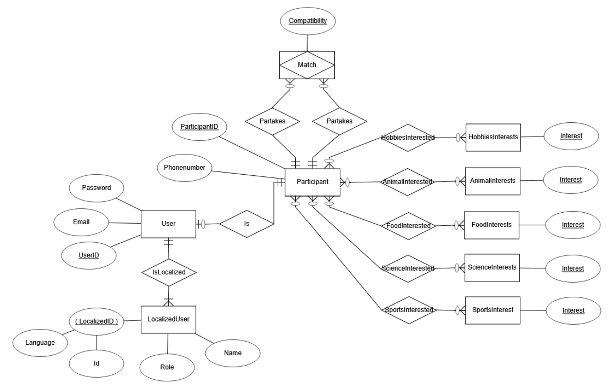
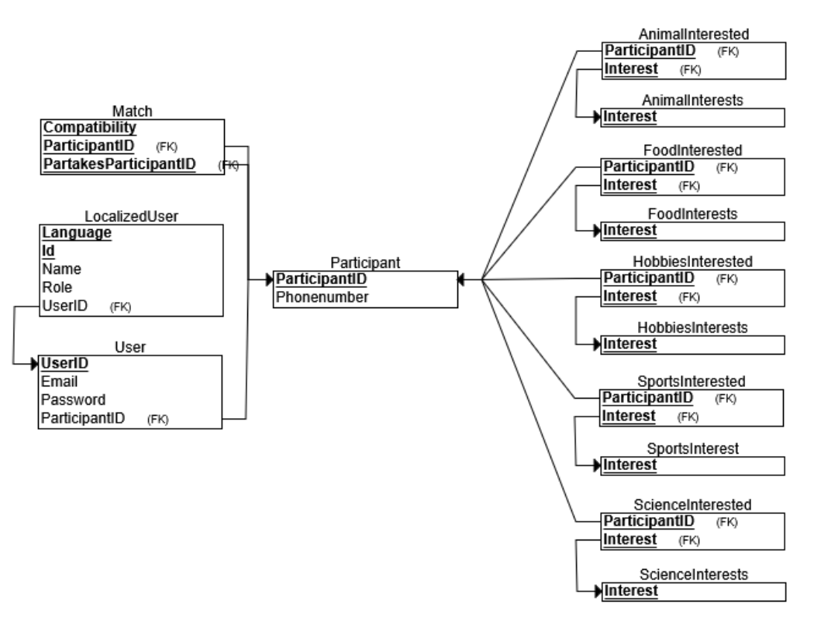

# Qupids - Speed Dating

**Qupids Speed Dating** is a locally hosted mock implementation of an automated speed dating system. It enhances event management by automating participant enrollment, interest selection, matchmaking, and match display, reducing the inefficiencies of manual speed dating events.

---

## 🌟 Features

- Automated Enrollment – Participants register with personal details.
- Interest-Based Matchmaking – Matches are determined by shared interests.
- Match Display – View pairing results post-session.
- Admin Controls – Manage users and matches through a database interface.
- Testing & Deployment – JUnit tests, CI/CD pipelines, and Docker implementation.

---

## 🌍 Language Support

**Qupids Speed Dating** supports multiple user interface languages for a more inclusive and localized experience:

   - 🇺🇸 English (en-US)

   - 🇫🇮 Finnish (fi-FI)

   - 🇯🇵 Japanese (ja-JP)

   - 🇨🇳 Chinese (zh-CN)

---

## 🎯 Matchmaking Algorithm

The application uses a compatibility based matchmaking algorithm to pair participants based on shared interests.

### ⚙️ How It Works

#### Interest Based Matching
- Each participant selects their interests before the session starts.
- The system retrieves a list of all potential matches from the database.

#### Compatibility Scoring
- A compatibility score 0-100% is calculated based on shared interests.
- Each shared interest increases compatibility, while unmatched interests reduce the maximum potential score.
- If a user has more interests, the score is evenly distributed across them.

#### Finding the Best Match
- The system identifies the highest compatibility match for each participant.
- If multiple users have the same compatibility score, they are both considered top matches.
- The algorithm excludes the participant themselves and skips low potential matches early for efficiency.

---

## 🔧 Technology Stack

### **Frontend**

- JavaFX 23.0.2 – Graphical user interface
- TestFX – GUI testing framework

### **Backend**

- Java 21 – Programming language
- Maven – Dependency & build management
- JPA (Jakarta Persistence API) & hibernate – ORM for database handling
- MariaDB – Relational database
- Mockito – Unit testing
- JaCoCo – Code coverage analysis

### **DevOps & Deployment**

- Docker – Containerization for easy deployment
- Jenkins – CI/CD pipeline automation
- Trello – Agile project management
- GitHub – Version control

---

## 🗃️ Database Design

The **Qupids Speed Dating** uses a relational database built with **MariaDB**, structured to support multilingual users, flexible interest tracking, and scalable matchmaking.

### Key Aspects of the Database

- **Participant**: The core entity, which includes both registered users and guests.
- **User & Guest**: Separated using joined-table inheritance via JPA, inheriting common fields from the `participants` table.
- **Interest**: Modeled as enums and linked to participants using categorized lists (e.g., hobbies, sports).
- **Match**: Created dynamically between participants, storing compatibility scores and links to shared interests.
- **Session**: Temporary state tracking the user’s current interest selection flow.

This design ensures normalization, avoids redundancy, and supports multilingual data through proper character encoding (`utf8mb4`) in both schema and queries.

---

### Entity-Relationship Diagram

> 

This diagram shows all the entities `Participant`, `User`, `Guest`, `Match`, `LocalizedUser`, and their relationships.

---

### Relational Schema

> 

The relational schema illustrates table structures, primary and foreign keys.

---

## 🛂 Project Structure

```
OTP_Group6/
│── src/
│   ├── main/
│   │   ├── java/
│   │   │   ├── context/       # Manages shared data and application state
│   │   │   ├── controller/    # Handles user interactions
│   │   │   ├── dao/           # Database access layer
│   │   │   ├── datasource/    # Manages database connections and persistence
│   │   │   ├── model/         # Database entity models
│   │   │   ├── scheduler/     # Handles scheduled tasks
│   │   │   ├── service/       # Business logic
│   │   │   ├── util/          # Utility functions and helpers
│   │   │   ├── view/          # JavaFX UI components
│   │   │   └── Main           # Application entry point
│   │   └── resources/
│   │       ├── css/           # Styling files
│   │       ├── fxml/          # UI layouts
│   │       ├── images/        # Image assets used in UI
│   │       ├── META-INF/      # Persistence and metadata configurations
│   │       ├── sql/           # Database initialization and scripts
|   |       └── messages/      # Resource bundle for multilingual UI support
|   |            ├── Messages_en_US.properties   # English
|   |            ├── Messages_fi_FI.properties   # Finnish
|   |            ├── Messages_ja_JP.properties   # Japanese
|   |            └── Messages_zh_CN.properties   # Chinese
│   └── test/                  # Unit tests
├── Dockerfile                 # Containerization
├── Jenkinsfile                # CI/CD automation pipeline
├── pom.xml                    # Maven configuration
└── README.md                  # Project documentation
```

---

## 🚀 Getting Started

### Prerequisites

Ensure you have the following installed:

- [Java 21](https://jdk.java.net/21/)
- [Maven](https://maven.apache.org/)
- [MariaDB](https://mariadb.org/)
- [Docker](https://www.docker.com/)

> 🪟 **Note for Windows/macOS users:**  
> If you're running the application via Docker locally, it uses a GUI (JavaFX), therefore you need an X server installed to display the interface. We recommend [**VcXsrv**](https://vcxsrv.com/) on Windows.  
>
> - After installing VcXsrv, launch it with:
>   - `Disable access control` enabled  
>   - `Multiple windows` or `One large window`
> 
> Without this, the GUI may not launch correctly from inside the Docker container.

### Setup

1. **Clone the Repository**:

   ```sh
   git clone https://github.com/Goliathuzzzz/OTP_Group6.git
   cd OTP_Group6
   ```

2. **Database Configuration**:

    - Start MariaDB and create a database named `qupids_db`.
    - Update `persistence.xml` with your database credentials.

3. **Build and Run**:

   ```sh
   mvn clean install
   mvn javafx:run
   ```

---

## 🛠 Usage

1. **Start the App**
   - Launch the application to access the main menu.

2. **Sign In / Register**
   - Choose to log in, create a new user, or continue as a guest.
   - If registering, fill in your email, phone number, and password.

3. **Begin a Session**
   - Click on **"aloita sessio"** (start session) to enter matchmaking.

4. **Select Your Interests**
   - Choose from available categories such as hobbies, food, or science.

5. **Match Found**
   - The system pairs you with a potential match based on shared interests.

6. **View Match Details**
   - See your compatibility percentage and common interests with your match.

---

## ✅ Testing

Run unit tests:

```sh
mvn test
```

Generate a JaCoCo test coverage report:

```sh
mvn jacoco:report
```

> **Testing Overview**  
> - Mockito – Used for mocking services and dependencies in unit tests.  
> - JaCoCo – Ensures code coverage analysis.  
> - TestFX – Simulates user interactions for GUI testing. 

---

## 🐳 Running the App with Docker

Build and launch the Docker container by running the following command from your project's root directory:

   ```sh
   docker-compose up --build
   ```

Ensure that VcXsrv is running in the background with the correct settings before starting the application!

---

## ✨ Future Enhancements

- Mobile App Development – Build a React Native version.
- Cloud Deployment – Move backend to Render, frontend to Vercel.
- Session Notifications – SMS/Email reminders for upcoming events.
- Two-Factor Authentication – Secure login with OTP/Auth apps.
- Advanced Admin Dashboard – Session tracking & analytics.

---

## 🤝 Contributors

- Ade Aiho
- Heta Hartzell
- Mika Laakkonen
- Jonne Roponen
